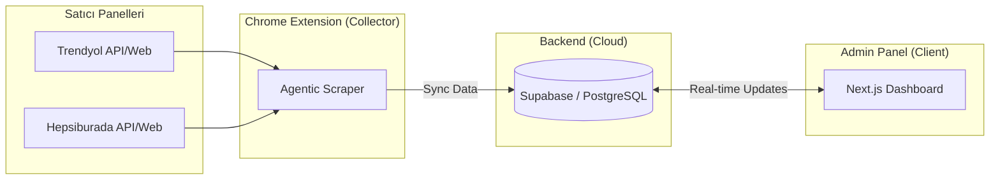

# 📊 E-Ticaret Micro-SaaS Dashboard & Extension

[](https://nextjs.org/)
[](https://tailwindcss.com/)
[](https://supabase.com/)
[](https://opensource.org/licenses/MIT)

Trendyol ve Hepsiburada satıcıları için geliştirilmiş, **otomatik veri senkronizasyonu** sağlayan modern bir yönetim panelidir. Bu proje, Chrome eklentisi aracılığıyla satıcı panelinden verileri kazıyıp Supabase üzerinden gerçek zamanlı (real-time) bir dashboard'a aktarır.

---

## ✨ Temel Özellikler

- **🟠 Çoklu Platform Desteği**: Trendyol ve Hepsiburada panelleriyle tam uyumlu.
- **🔄 Otomatik Senkronizasyon**: Chrome eklentisi arka planda çalışarak sipariş, stok ve yorum verilerini anlık olarak Supabase'e aktarır.
- **📈 Modern Görselleştirme**: Recharts ile gelir trendleri ve platform bazlı sipariş dağılımı.
- **🛍️ Stok Yönetimi**: Düşük stoklu ürünler için akıllı uyarı sistemi.
- **⭐ Yorum Analizi**: Müşteri geri bildirimlerini ve puan dağılımlarını tek ekranda görün.
- **📱 Responsive Tasarım**: Tailwind CSS v4 ile mobil, tablet ve masaüstü uyumlu premium arayüz.
- **🔐 Güvenli Auth**: Supabase Auth ile mağaza bazlı izole veri yönetimi.

---

## 🏗️ Sistem Mimarisi



---

## 📁 Proje Yapısı

| Klasör | Açıklama |
|--------|----------|
| `dashboard/` | Next.js 14+/15 Tabanlı Yönetim Paneli (Tailwind v4) |
| `chrome-extension/` | Manifest V3 Veri Toplayıcı Eklenti |
| `supabase/` | Veritabanı Şeması, SQL Trigger fonksiyonları ve Test Verileri |

---

## 🚀 Hızlı Kurulum

### 1️⃣ Veritabanı (Supabase)
1. [Supabase](https://supabase.com) üzerinden yeni bir proje oluşturun.
2. `supabase/full_setup.sql` dosyasını SQL Editor'da çalıştırın. (Bu dosya tüm tabloları, RLS politikalarını ve trigger'ları tek seferde kurar.)

### 2️⃣ Chrome Eklentisi
1. `chrome-extension/lib/supabase.js` içindeki API bilgilerini güncelleyin.
2. `chrome://extensions` -> *Geliştirici Modu* -> *Paketlenmemiş yükle* -> `chrome-extension` klasörünü seçin.

### 3️⃣ Dashboard
```bash
cd dashboard
npm install
cp .env.local.example .env.local  # Bilgileri doldurun
npm run dev
```

---

## 🛠️ Teknoloji Yığını

- **Frontend**: Next.js (App Router), React 18/19
- **Styling**: Tailwind CSS v4 (Modern & Premium Aesthetics)
- **Database/Auth**: Supabase (PostgreSQL)
- **Charts**: Recharts
- **Icons**: Lucide React
- **Extension**: Chrome Manifest V3 (Service-Worker approach)

---

## 📄 Lisans

Bu proje [MIT](LICENSE) lisansı altında lisanslanmıştır.

---

<p align="center">
  Geliştiren: <b>[Muhammet Talha Eyüboğlu]</b>
</p>
